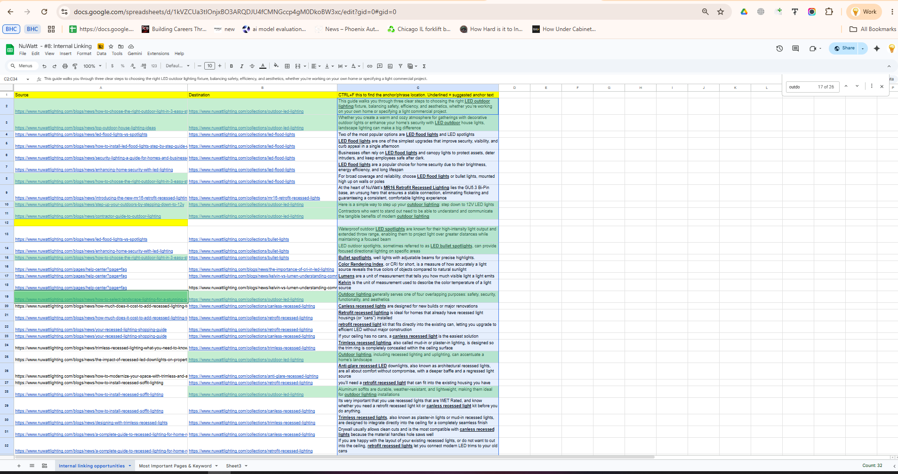

# Optimasi Peluang Internal Linking

> Identifikasi peluang internal linking kontekstual dari artikel blog yang sudah ada menuju halaman produk, kategori, koleksi, atau layanan yang relevan.

---

## Detail Proyek

| Item | Keterangan |
|---|---|
| Peran | Anggota Inbound Marketing Team |
| Jenis Proyek | On-Page SEO / Internal Linking Optimization |
| Ruang Lingkup | Review konten, pemetaan source-destination, identifikasi konteks, dan rekomendasi anchor text |
| Kolaborasi | Koordinasi proses review dan implementasi dengan tim terkait |
| Tools | Google Sheets, Google Docs, Project Management Platform, Existing Website Content |
| Klien | Dianonimkan untuk kebutuhan portofolio |

---

## Gambaran Proyek

Proyek ini merupakan bagian dari aktivitas rutin **Inbound Marketing Team** untuk mengidentifikasi dan mengoptimalkan peluang internal linking pada artikel blog yang sudah ada.

Saya bertanggung jawab meninjau artikel, menentukan halaman tujuan yang relevan, menemukan konteks atau kalimat yang tepat untuk penempatan internal link, serta merekomendasikan anchor text yang natural dan deskriptif.

Rekomendasi internal linking disusun untuk menghubungkan artikel informasional dengan halaman produk, kategori, koleksi, atau layanan yang relevan.

---

## Peran dan Tanggung Jawab

Sebagai anggota **Inbound Marketing Team**, saya bertanggung jawab untuk:

- Meninjau artikel blog yang sudah ada untuk menemukan peluang internal linking.
- Memetakan artikel sumber ke halaman tujuan yang paling relevan.
- Mengidentifikasi kalimat atau frasa yang dapat digunakan sebagai lokasi penempatan internal link secara natural.
- Merekomendasikan anchor text yang deskriptif, relevan, dan sesuai konteks.
- Mendokumentasikan source URL, destination URL, rekomendasi anchor text, serta konteks penempatan dalam spreadsheet.
- Meninjau dan menyempurnakan rekomendasi sebelum masuk ke tahap implementasi.

---

## Tujuan Proyek

Proyek ini bertujuan untuk memperkuat struktur internal linking pada existing content melalui:

- Menghubungkan konten blog dengan halaman produk, kategori, koleksi, atau layanan yang relevan.
- Mengidentifikasi peluang internal linking yang sesuai secara kontekstual.
- Membantu pengguna menavigasi halaman-halaman yang saling berkaitan.
- Merekomendasikan anchor text yang natural dan menjelaskan halaman tujuan.
- Mendukung optimasi on-page SEO melalui struktur internal linking yang lebih terorganisasi.

---

## Metodologi dan Alur Kerja

### 1. Review Konten

Saya melakukan review terhadap artikel blog yang sudah ada untuk memahami:

- Topik utama artikel.
- Search intent atau tujuan pencarian pengguna.
- Produk, kategori, koleksi, atau layanan yang relevan.
- Konteks dalam artikel yang dapat mendukung penempatan internal link secara natural.

### 2. Pemetaan Source dan Destination

Setiap artikel yang memiliki peluang internal linking dipetakan dengan halaman tujuan yang paling relevan.

| Kolom | Keterangan |
|---|---|
| Source Page | Artikel blog yang menjadi lokasi penempatan internal link |
| Destination Page | Halaman produk, kategori, koleksi, atau layanan yang dituju |
| Suggested Anchor Text | Frasa atau teks yang direkomendasikan sebagai anchor text |
| Suggested Placement / Context | Kalimat atau bagian artikel yang direkomendasikan untuk penempatan link |

Source page merupakan halaman tempat internal link akan ditempatkan, sedangkan destination page adalah halaman tujuan yang ingin diperkuat melalui internal link yang relevan.

### 3. Identifikasi Peluang Kontekstual

Untuk setiap source page, saya mengidentifikasi kalimat atau frasa yang dapat menjadi lokasi internal link secara natural.

Penilaian dilakukan dengan mempertimbangkan:

- Relevansi topik antara source page dan destination page.
- Kesesuaian konteks dalam kalimat.
- Hubungan antara konten informasional dan halaman tujuan.
- Alur baca artikel agar tetap natural.
- User intent atau kebutuhan pengguna.

Tujuannya adalah memastikan setiap rekomendasi internal link bermanfaat bagi pembaca dan tidak terasa dipaksakan di dalam konten.

### 4. Rekomendasi Anchor Text

Setelah menemukan lokasi yang sesuai, saya merekomendasikan anchor text yang menggambarkan halaman tujuan secara jelas dan relevan.

Anchor text dipilih berdasarkan:

- Relevansi terhadap halaman tujuan.
- Kesesuaian dengan konteks kalimat.
- Keterbacaan yang natural.
- Kesesuaian topik antara source dan destination page.
- Kejelasan makna bagi pengguna.

### 5. Dokumentasi Spreadsheet

Seluruh peluang internal linking didokumentasikan dalam spreadsheet untuk mendukung proses review, implementasi, dan tracking.

Data yang dicatat meliputi:

- Source URL.
- Destination URL.
- Suggested anchor text.
- Suggested placement atau konteks kalimat.
- Catatan tambahan atau rekomendasi implementasi.

Spreadsheet digunakan sebagai referensi kerja agar tim dapat menemukan konteks penempatan internal link pada source article dengan lebih mudah.

### 6. Review dan Persiapan Implementasi

Hasil mapping disiapkan untuk proses review oleh tim terkait.

Setelah rekomendasi disetujui, internal link dapat diimplementasikan pada konten yang sudah ada berdasarkan source page, destination page, konteks penempatan, dan anchor text yang telah didokumentasikan.

---

## Contoh Peluang Internal Linking

Salah satu peluang internal linking ditemukan pada artikel yang membahas **outdoor lighting**. Artikel tersebut memiliki konteks yang relevan untuk diarahkan ke halaman **outdoor LED lighting**.

Proses yang dilakukan:

1. Mengidentifikasi artikel dengan pembahasan terkait outdoor lighting.
2. Menentukan halaman produk atau kategori yang paling relevan sebagai destination page.
3. Menemukan kalimat yang memungkinkan penempatan internal link secara natural.
4. Merekomendasikan anchor text yang relevan dengan halaman tujuan.
5. Mendokumentasikan rekomendasi pada internal linking opportunity sheet.

Pendekatan ini membantu menghubungkan konten informasional dengan halaman komersial atau produk yang relevan, tanpa mengganggu konteks dan alur baca artikel.

---

## Deliverables

Proyek ini menghasilkan **Internal Linking Opportunity Sheet** yang berisi:

- Source page URL.
- Destination page URL.
- Rekomendasi anchor text.
- Rekomendasi konteks atau lokasi penempatan link.
- Catatan untuk proses review dan implementasi.

---

## Contoh Dokumentasi

Seluruh screenshot dan dokumentasi berikut telah dianonimkan untuk menjaga kerahasiaan data klien.

| Task dan Komunikasi Proyek | Internal Linking Opportunity Sheet |
|---|---|
|  |  |

*Gambar 1. Contoh task proyek dan internal linking opportunity sheet yang telah dianonimkan.*

### Dokumentasi Pendukung

- [Detail Internal Linking Opportunity Sheet](assets/screenshots/internal-linking-opportunity-sheet-detail.png)
- [Contoh Source-to-Destination Mapping](assets/screenshots/source-destination-mapping-example.png)
- [Contoh Rekomendasi Anchor Text](assets/screenshots/suggested-anchor-text-example.png)

---

## Tools

- **Google Sheets** — Pemetaan internal link, dokumentasi, review, dan tracking.
- **Google Docs / Project Management Platform** — Komunikasi task, review, dan koordinasi.
- **Existing Website Content** — Analisis konten, relevansi topik, dan peluang penempatan internal link.

---

## Kompetensi yang Ditunjukkan

- Internal Linking Strategy
- On-Page SEO
- Content Analysis
- Search Intent Analysis
- Source-to-Destination Mapping
- Contextual Link Placement
- Anchor Text Recommendation
- Content Optimization
- SEO Documentation
- Spreadsheet Management
- Cross-Team Collaboration

---

## Outcome

Proyek ini menghasilkan daftar peluang internal linking yang terstruktur dari existing blog content menuju halaman produk, kategori, koleksi, dan layanan yang relevan.

Dokumentasi tersebut membantu tim melakukan proses review dan implementasi internal link secara lebih sistematis berdasarkan:

- Relevansi topik antara source page dan destination page.
- Konteks penempatan internal link yang natural dalam artikel.
- Rekomendasi anchor text yang deskriptif dan relevan.
- Referensi implementasi yang jelas melalui mapping spreadsheet.

---

## Catatan Kerahasiaan

Nama klien, domain, URL, screenshot, dan data internal telah dianonimkan atau disamarkan untuk kebutuhan portofolio. Materi dalam repositori ini hanya digunakan untuk menunjukkan alur kerja, proses dokumentasi, serta pendekatan analisis internal linking yang saya lakukan.
